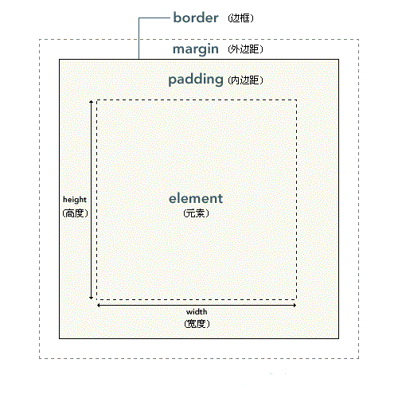
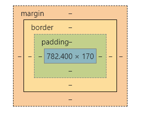
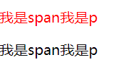
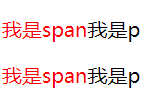
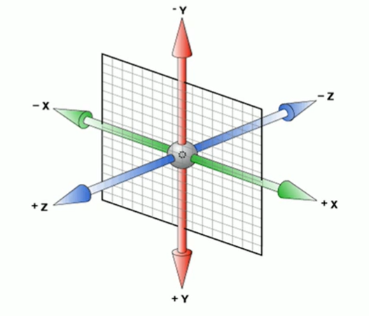

# 样式的书写位置

## 行内样式

```css
<span style="color: red;">内联样式</span>
```

## 内嵌样式

用的最多，把需要用的css代码都集中放到style标签里面

```css
<style type="text/css">
  span{
    color: red;
  }
</style>
<span>内嵌样式</span>
```

## 链接样式

如果css代码很多的话，可以单独打包到一个文件里面，然后这样导入，做到html和css的分离。

```css
<link rel="stylesheet" href="" type="text/css">
```

## 导入样式

跟链接样式类似，可以导入外部的css代码，不过这个是写在style里面的。一共有6种写法。

```css
<style>
  @import 某某某;
  @import '';
  @import "";

  @import url();
  @import url('');
  @import url("");
</style>
```

也就是说css不关心引号的写法，没有也可以。

# 基本样式

## 文字相关

### 文字颜色

```css
color: black;
```

颜色请参考我的颜色对照表

### 文本对齐

```css
text-align:center;
```

| 值      | 描述                                        |
| ------- | ------------------------------------------- |
| left    | 把文本排列到左边。                          |
| right   | 把文本排列到右边。                          |
| center  | 把文本排列到中间。                          |
| justify | 实现两端对齐文本效果。                      |
| inherit | 规定应该从父元素继承 text\-align 属性的值。 |

### 下划线

```css
text-decoration:none;
```

| 值            | 描述                                             |
| ------------- | ------------------------------------------------ |
| none          | 默认。定义标准的文本。                           |
| underline     | 定义文本下的一条线。                             |
| overline      | 定义文本上的一条线。                             |
| line\-through | 定义穿过文本下的一条线。                         |
| blink         | 定义闪烁的文本。                                 |
| inherit       | 规定应该从父元素继承 text\-decoration 属性的值。 |

### 行高

```css
line-height:20px;
```

| 值      | 描述                                                 |
| ------- | ---------------------------------------------------- |
| normal  | 默认。设置合理的行间距。                             |
| 某数字  | 设置数字，此数字会与当前的字体尺寸相乘来设置行间距。 |
| 某某px  | 设置固定的行间距。                                   |
| %       | 基于当前字体尺寸的百分比行间距。                     |
| inherit | 规定应该从父元素继承 line\-height 属性的值。         |

### 文字阴影

```css
text-shadow: 10px 5px 2px #FF0000;
```

| 参数       | 描述                                   |
| ---------- | -------------------------------------- |
| 第一个参数 | 必需。阴影离文字的水平距离。允许负值。 |
| 第二个参数 | 必需。阴影离文字的垂直距离。允许负值。 |
| 第三个参数 | 可选。代表这个阴影有多模糊。           |
| 第四个参数 | 可选。阴影的颜色。                     |

### 首行缩进

1em就是一个文字大小的空间

```css
text-indent: 2em;
```


## 背景相关

### 背景颜色

```css
background-color: gray;
background-color: #bfc;
```

### 背景图片

```css
background-image:url("");
```

### 背景图片重复

```css
background-repeat:no-repeat;
```

| 值         | 描述                                                 |
| ---------- | ---------------------------------------------------- |
| repeat     | 默认。背景图像将在垂直方向和水平方向重复。           |
| repeat\-x  | 背景图像将在水平方向重复。                           |
| repeat\-y  | 背景图像将在垂直方向重复。                           |
| no\-repeat | 背景图像将仅显示一次。                               |
| inherit    | 规定应该从父元素继承 background\-repeat 属性的设置。 |


### 背景开始的位置

设置background-attachment:fixed;才能兼容 Firefox 和 Opera 浏览器

```css
background-attachment:fixed;
background-position:center;
```

<table>
  <tbody>
    <tr>
      <th>值</th>
      <th>描述</th>
    </tr>
    <tr>
      <td>
        <ul>
          <li>top left</li>
          <li>top center</li>
          <li>top right</li>
          <li>center left</li>
          <li>center center</li>
          <li>center right</li>
          <li>bottom left</li>
          <li>bottom center</li>
          <li>bottom right</li>
        </ul>
      </td>
      <td>
        <p>如果您仅规定了一个关键词，那么第二个值将是"center"。</p>
        <p>默认值：0% 0%。</p>
      </td>
    </tr>
    <tr>
      <td>x% y%</td>
      <td>
        <p>第一个值是水平位置，第二个值是垂直位置。</p>
        <p>左上角是 0% 0%。右下角是 100% 100%。</p>
        <p>如果您仅规定了一个值，另一个值将是 50%。</p>
      </td>
    </tr>
    <tr>
      <td>xpos ypos</td>
      <td>
        <p>第一个值是水平位置，第二个值是垂直位置。</p>
        <p>左上角是 0 0。单位是像素 (0px 0px) 或任何其他的 CSS 单位。</p>
        <p>如果您仅规定了一个值，另一个值将是50%。</p>
        <p>您可以混合使用 % 和 position 值。</p>
      </td>
    </tr>
  </tbody>
</table>
## 尺寸相关

### 宽度

```css
width:100px;
```

## 鼠标相关

一般搭配伪类使用

### 鼠标悬停样式

| 值         | 描述                                                |
| ---------- | --------------------------------------------------- |
| url        | 想传送的url                                         |
| default    | 默认光标（通常是一个箭头）                          |
| auto       | 默认。浏览器设置的光标。                            |
| crosshair  | 光标呈现为十字线。                                  |
| pointer    | 光标呈现为指示链接的指针（一只手）                  |
| move       | 此光标指示某对象可被移动。                          |
| e\-resize  | 此光标指示矩形框的边缘可被向右（东）移动。          |
| ne\-resize | 此光标指示矩形框的边缘可被向上及向右移动（北/东）。 |
| nw\-resize | 此光标指示矩形框的边缘可被向上及向左移动（北/西）。 |
| n\-resize  | 此光标指示矩形框的边缘可被向上（北）移动。          |
| se\-resize | 此光标指示矩形框的边缘可被向下及向右移动（南/东）。 |
| sw\-resize | 此光标指示矩形框的边缘可被向下及向左移动（南/西）。 |
| s\-resize  | 此光标指示矩形框的边缘可被向下移动（南）。          |
| w\-resize  | 此光标指示矩形框的边缘可被向左移动（西）。          |
| text       | 此光标指示文本。                                    |
| wait       | 此光标指示程序正忙（通常是一只表或沙漏）。          |
| help       | 此光标指示可用的帮助（通常是一个问号或一个气球）。  |

## 其他常用样式

### 透明

请设置在[0-1]之间

```css
opacity: 值;
```

### 圆角

```css
/*默认全部角*/
border-radius: 25px;
/*分别设置*/
border-radius: 15px 50px 30px 5px:
```


# 盒模型

## 概述

盒模型相关的样式包括:

- 内外边距
- 边框

CSS认为,每一个文档的元素都是一个盒子,这个盒子包括自身的大小,边框大小,内边距和外边距.如下图:



如果在浏览器(以chrome为例)里面用开发者工具查看,可以发现,实际上内外边距,外边距还有边框都是占地方的,

```css
p{
  border: #ADFF2F 10px solid;
  padding: 20px;
  margin: 30px;
  width: 50px;
  height: 50px;
}
```




这些样式的区别就在于,内边距是算在元素本身的大小里面的,啥意思呢,就比如你元素宽20px,内边距你两边各加10px,那么你这个元素整体就宽40px.边框也是一样的,但是外边距不会算在元素里面.

## 边框

### 概述

一个元素有上下左右四个边框(废话),css允许分别定义各个方向上边框的样式.比如说

```css
border-color:red green blue pink;
```

分别为上,右,下,左指定不同颜色.也就是从上开始,顺时针排列.

<p style="border-style:solid; border-color:red green blue pink;border-width:5px;width:100px;height:100px"></p>


```css
border-color:red green blue;
```

如果只写三个,那么第一个是上边框,第二个是左右边框,第三个是下边框.

<p style="border-style:solid; border-color:red green blue;border-width:5px;width:100px;height:100px"></p>

```css
border-color:red green;
```

只写两个的话就是上下边框,左右边框

<p style="border-style:solid; border-color:red green;border-width:5px;width:100px;height:100px"></p>

```
border-color:red;
```

一个的话肯定就是全部红喽;

<p style="border-style:solid; border-color:red;border-width:5px;width:100px;height:100px"></p>

这样分别指定样式的操作,在边框里面是通用的,也可以来指定宽度,表现等.如果不想这样隐式指定,也可以显示指定.

```css
border-top-width: 15px;
border-right-color: blue;
border-left-style: solid;
border-bottom-color: red;
```

像这样子,直接指定也是可以的.

**注意:!!!!!!!!!!!!!!只有把width,style和color都指定了之后才能正常显示边框,否则不会显示!!!!!!!!!!!!!!!!!!.**

### 边框表现

```css
border-style:solid;
```

| 值      | 描述                                                         |
| ------- | ------------------------------------------------------------ |
| none    | 定义无边框。                                                 |
| hidden  | 与 "none" 相同。不过应用于表时除外，对于表，hidden 用于解决边框冲突。 |
| dotted  | 定义点状边框。在大多数浏览器中呈现为实线。                   |
| dashed  | 定义虚线。在大多数浏览器中呈现为实线。                       |
| solid   | 定义实线。                                                   |
| double  | 定义双线。双线的宽度等于 border\-width 的值。                |
| groove  | 定义 3D 凹槽边框。其效果取决于 border\-color 的值。          |
| ridge   | 定义 3D 垄状边框。其效果取决于 border\-color 的值。          |
| inset   | 定义 3D inset 边框。其效果取决于 border\-color 的值。        |
| outset  | 定义 3D outset 边框。其效果取决于 border\-color 的值。       |
| inherit | 规定应该从父元素继承边框样式。                               |

### 边框宽度

```css
border-width:20px;
```

| 值      | 描述                           |
| ------- | ------------------------------ |
| thin    | 定义细的边框。                 |
| medium  | 默认。定义中等的边框。         |
| thick   | 定义粗的边框。                 |
| 某某px  | 自定义宽度                     |
| inherit | 规定应该从父元素继承边框宽度。 |

### 边框颜色

```css
border-color:red green blue pink;
```

跟字体颜色一样,详情参考颜色表.

### 简写

因为边框想要生效必须指定三个属性,写起来确实很麻烦,为了增加程序员的寿命,HTML支持边框的简写

```css
border:5px solid red;
```

像这样,可以一次性设置三个属性.

# 选择器

## 基本选择器

### *选择器

就是全选的意思,选中html文档中所有的元素.

```css
*{
  margin:0;
  padding:0;
}
```

### 元素选择器

可以直接选择某一个标签,然后直接对HTML中所有这种标签进行批量编辑.

```css
p{
  color:red;
}
```

这个就是让所有p标签内部文字颜色变为红色.

### 类选择器

可以批量选择自定义的类,用于某一类特定的标签.

html:

```html
<ul>
  <li class="item">java</li>
  <li class="item">c#</li>
  <li class="item">sql</li>
  <li class="item">css</li>
</ul>
```

css:

```html
<style type="text/css">
	.item{
		color:blue
	}
</style>
```

一般类选择器选择的都是某一类标签,在需要添加这个类的标签前面加上`class`,后面可以指定想要的类,类名可以随便起.在css里面用点类名的办法,选择所有该类.

一般来说,类选择器都是批量选择很多该类的标签,比如说ul的列表,li有很多很多条,为每一个li单独设计样式岂不是累死了,所以可以给他们起一个类名item,批量添加这些li的样式.

### ID选择器

只能选择某一个特定的标签,一般只有一些特殊含义的标签才用起ID.还是刚才的例子.

html:

```html
<ul id="language-list">
  <li class="item">java</li>
  <li class="item">c#</li>
  <li class="item">sql</li>
  <li class="item">css</li>
</ul>
```

css:

```html
<style type="text/css">
	#language-list{
		color:blue
	}
</style>
```

ID选择器中,css用#加ID名就可以选中标签,一般一个网页里面这个语言列表可能就这么一个,所以比较特殊,可以用ID选择器来选中,直接操作这个标签.

## 组合选择器

### 包含选择器

选择所有div里面span元素

```css
div span{
	color:red;
}
```

### 子选择器

选择div下的子元素

```css
div > span{
	color:red;
}
```

### 相邻选择器

说是选相邻，其实也不是真正的相邻元素，它只能按照+前后的顺序排列的元素，也就是说#s1之后必须是#s2，顺序颠倒也不行。

```html
<head>
	<style>
		#s1 + #s2{
			color:red;
		}
	</style>
</head>
<body>
		<div>
			<span id="s1">s1</span>
			<span id="s2">s2</span>
			
		</div>
</body>
```

### 兄弟选择器

相邻选择器选择的元素必须是相邻的同级元素，而兄弟选择器的要求就低一点了，只要是在#s1后定义的#s2就能被选中，中间可以不用相邻，隔着其他元素也可以。

```html
<head>
	<style>
		#s1 ~ #s2{
			color:red;
		}
	</style>
</head>
<body>
		<div>
			<span id="s1">s1</span>
			<span></span>
			<span id="s2">s2</span>
		</div>
</body>
```

### 并集选择器

如果你想同时给多个不同元素设置样式,可以用并集选择器

```css
body, h2, p, table, th, td, pre, strong, em {color:gray;}
```

像这样,彼此之间用逗号隔开,表示同时选中.

## 伪类选择器

名字虽然很酷,其实没那么复杂,这个玩意可以来操作一些特殊的类,比如超链接的样式,输入框聚焦后的样式等等.写法就是在需要添加的元素后面冒号,然后加入想加入的伪类即可.

### 动态伪类

#### 锚点伪类

```css
a:link {color: #FF0000}		/* 未被访问的超链接 */
a:visited {color: #00FF00}	/* 已访问的链接 */
```

#### 行为伪类

```css
a:hover {color: #FF00FF}	/* 鼠标移动到超链接上的时候 */
a:active {color: #0000FF}	/* 鼠标点下去的一瞬间 */
input:focus{color: #bfbfbf;} /*获取到焦点后，一般用于文本框*/	
```

### 结构伪类

#### first-child

顾名思义,就是选择第一个子元素,但是这里面有很多坑,必须注意

先看html:

```HTML
<p><span>我是span</span>我是p</p>
<p><span>我是span</span>我是p</p>
```


- 选择所有p标签中,第一个p标签

```css
p:first-child{
  color: red;
} 
```



- 选择所有p标签内部第一个子元素

```css
p>:first-child {
	color: red;
}
```



#### before和after

可以用这两个伪类,在某个元素前面或后面插入文本.用content来控制文本内容.

```css
p:before
{
	content:"我是before加的";
}
p:after
{
	content:"我是after加的";
}
```

### 状态伪类

这个是用来选择表单元素的。

- enabled

选中所有可用的表单元素

```html
<head>
	<style>
		input:enabled{
			color: #bfbfbf;
		}	
	</style>
</head>
<body>
	<form action="">
		<input type="text">
		<input type="button" value="按钮">
	</form>
</body>
```

此时将会把文本框和按钮都选中，因为默认情况下表单元素是enabled

- disabled

选中所有不可用的表单元素

```html
<head>
	<style>
		input:disabled{
			color: red;
		}	
	</style>
</head>
<body>
	<form action="">
		<input type="text">
		<input type="button" value="按钮" disabled>
	</form>
</body>
```


## 属性选择器

如果你想选择带某个属性的标签,可以用属性选择器.但是里面也有很多坑,需要注意.

- 指定某种属性

```css
a[href] {color:red;}
```

这个例子就是选择所有有href属性的a标签.也可以同时指定多个属性:

- 指定同时具有多种属性

```css
a[href][title] {color:red;}
```

这个就是选择同是有href和title属性的a标签

- 精确指定某个具体属性

```css
p[class="A B"] {color:red;}
```

选择某个有具体属性的标签,注意这个要求严格等于,也就是说你的class也必须是"A B",多一个空格都不行.这时候我们就可以使用下面的写法了.

- 含有某种属性

```css
p[class~="A"] {color: red;}
```

用这个~可以表示含有A的class,不用严格匹配.

属性选择器也支持三种正则语法:

- 包含某字符串的属性

```css
a[href*="dashepi.com"] {color: red;}
```

选择a标签的超链接中包含"dashepi.com"这个字符串的所有a标签

- 以某字符串开头的属性

```css
a[href^="www."] {color: red;}
```

选择href以"www."开头的a标签

- 以某字符串结尾的属性

```css
a[href$=".cn"] {color: red;}
```

选择href以".cn"结尾的a标签


# 选择器优先级

## 选择器的权重

- 标签选择器：1
- 伪类选择器：1
- 类选择器：10
- 属性选择器：10
- ID选择器：100
- 其他选择器：0

## !important

!important修饰的css代码具有最高的优先级

# 定位与浮动

## 浮动


## 外边距重叠

## 高度塌陷

## 最终解决代码

```css
.clearfix::before,
.clearfix::after{
  content: "";
  display: table;
  clear: both;
}
```


# flex布局

传统的网页布局是靠 [`display`](https://developer.mozilla.org/en-US/docs/Web/CSS/display) 属性 + [`position`](https://developer.mozilla.org/en-US/docs/Web/CSS/position)属性 + [`float`](https://developer.mozilla.org/en-US/docs/Web/CSS/float)属性完成的，不仅难用，而且bug频出。后来W3C忽悠引出了flex布局，用于替代传统布局。

flex布局核心就在于属性的使用。

- flex-direction：决定元素排列方向
- flex-wrap：控制换行
- justify-content：横向对齐方式
- align-items：竖向对齐方式
- align-content：控制多轴下的对齐方式

注意，一旦使用了flex布局，子元素的`float`、`clear`和`vertical-align`属性将失效。

## flex-direction

| 值             | 作用                         |
| -------------- | ---------------------------- |
| row            | 主轴为水平方向，起点在左端。 |
| row-reverse    | 主轴为水平方向，起点在右端。 |
| column         | 主轴为垂直方向，起点在上沿。 |
| column-reverse | 主轴为垂直方向，起点在下沿。 |

子元素垂直水平居中

```css
display: flex;
align-items:center;  
justify-content:center;
```


# 动画

## 定义与使用

定义：

```css
@keyframes 名字{
	from{
		/* 开始的样式  */
	}
	to{
		/* 结束的样式  */
	}
}
```

使用：

```css
#test{
  width: 200px;
  height: 200px;
  background-color: #ADFF2F;
  /* 调用的动画名称 */
  animation-name: 刚刚定义的名字;
  /* 执行动画的时间 */
  animation-duration: 150ms;
}
```

## 动画序列

`from to`只能用于一个过程，一次执行完，如果想要分步执行，可以设置时间点，来设置每一个时间点的状态。

```css
@keyframes move {
	0% {
		transform: translate(0px, 0px);
	}

	25% {
		transform: translate(1000px, 0px);
	}

	50% {
		transform: translate(1000px, 500px);
	}

	75% {
		transform: translate(0px, 500px);
	}

	100% {
		transform: translate(0px, 0px);
	}
}

```

## 常用的属性

| 属性                        | 描述                                                       |
| --------------------------- | ---------------------------------------------------------- |
| @keyframes                  | 规定动画。                                                 |
| animation                   | 所有动画属性的简写属性，除了 animation\-play\-state 属性。 |
| animation\-name             | 规定 @keyframes 动画的名称。                               |
| animation\-duration         | 规定动画完成一个周期所花费的秒或毫秒。默认是 0。           |
| animation\-timing\-function | 规定动画的速度曲线。默认是 "ease"。                        |
| animation\-delay            | 规定动画何时开始。默认是 0。                               |
| animation\-iteration\-count | 规定动画被播放的次数。默认是 1。                           |
| animation\-direction        | 规定动画是否在下一周期逆向地播放。默认是 "normal"。        |
| animation\-play\-state      | 规定动画是否正在运行或暂停。默认是 "running"。             |
| animation\-fill\-mode       | 规定对象动画时间之外的状态。                               |


# 3D转换

## 坐标规定

- x轴：水平向右 ，x右边是正值，左边是负值
- y轴︰垂直向下 ，y下面是正值，上面是负值
- z轴︰垂直屏幕 ，往外面是正值，往里面是负值



## 3D位移

可以直接来创建某一方向的位移

```css
transform: translateX();
transform: translateY();
transform: translateZ();
```

但是要注意，如果把这三行代码放在一起，后面的会覆盖上面的，所以如果想同时设置多个坐标，需要用其他方法。

```css
transform: translate3d(x,y,z);
```

## 3D透视

就是指的近大远小，**如果想要某一个元素拥有透视，需要给其父元素设置透视**。

```html
<!DOCTYPE html>
<html>
	<head>
		<style>
			#out{
				perspective: 500px;
			}
			#in{
				width: 100px;
				height: 100px;
				background-color: #BC8F8F;
				transform: translate3d(0,0,60px);
			}
		</style>
	</head>
	<body>
		<div id="out">
			<div id="in">
				123
			</div>
		</div>
	</body>
</html>
```


# 实用技巧

## 设置长宽相等

- (根据宽度设置高度)如果确定width:100%;则设置高度 height: 100vw;

- (根据高度设置宽度)如果确定高度height:100%;则设置 width: 100vh;

- (根据宽度设置高度)如果确定width:60%;则设置高度 height: 60vw;

- (根据高度设置宽度)如果确定高度height:60%;则设置 width: 60vh;

- ```css
  width: 20%;
  height: 20vw;
  ```

## 设置标签水平垂直居中

```css
父元素{
  display: flex;
}

子元素{
  /*水平居中*/
  margin: 0 auto;
  /*垂直居中*/
  align-self: center;
}
```

## 设置背景图片全屏

```css
position: fixed;
top: 0;
left: 0;
width: 100%;
height: 100%;
min-width: 1000px;
z-index: -10;
zoom: 1;
background-color: #fff;
background-repeat: no-repeat;
background-size: cover;
-webkit-background-size: cover;
-o-background-size: cover;
background-position: center 0;
background-image: url("~assets/img/background/001.png");
```

# 实用动画

## 热点图

```html
<!DOCTYPE html>
<html>
	<head>
		<style>
			#test {
				width: 200px;
				height: 200px;
				background-color: black;
				opacity: 0.5;
			}
			@keyframes hotspot{
				0%{}
				70%{
					width: 40px;
					height: 40px;
					opacity: 1;
				}
				100%{
					width: 70px;
					height: 70px;
					opacity: 0;
				}
			}
			.hotspot{
				position: absolute;
				top: 100px;
				left: 100px;
			}
			.hotspot #dot{
				width: 8px;
				height: 8px;
				background-color: aqua;
				border-radius: 50%;
			}
			.hotspot [class^="wave"]{
				width: 8px;
				height: 8px;
				box-shadow: 0 0 12px aqua;
				
				position: absolute;
				top: 50%;
				left: 50%;
				transform: translate(-50%,-50%);
				border-radius: 50%;
				
				animation: hotspot 1.2s linear infinite;
			}
			.hotspot .wave2{
				animation-delay: 0.4s;
			}
			.hotspot .wave3{
				animation-delay: 0.8s;
			}
		</style>
	</head>
	<body>
		<div id="test">
			<div class="hotspot">
				<div id="dot"></div>
				<div class="wave1"></div>
				<div class="wave2"></div>
				<div class="wave3"></div>
			</div>
		</div>
	</body>
</html>
```

## 使用逐帧动画

```css
@keyframes play{
  0%{
    background-position: 0,0;
  }
  100%{
    background-position: -图片长度,0;
  }
}
.anima{
  width: 200px;
  height: 100px;
  background: url(图片位置) no-repeat;
  animation: play 2s steps(有几张图) infinite;
}
```